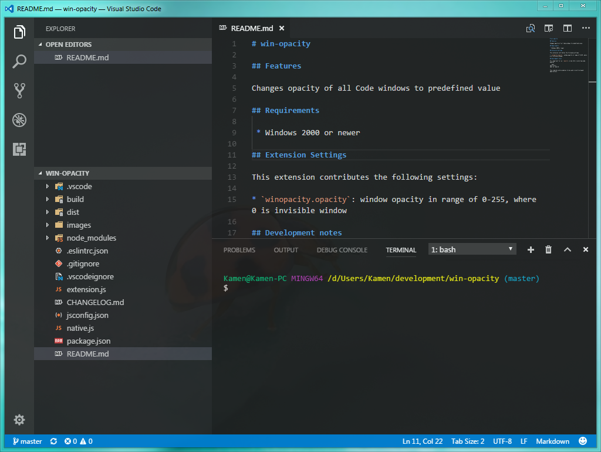

## Features

Changes opacity of all Code windows to predefined value



## Requirements

 * **64bit version of Visual Studio Code**
 * Windows 2000 or newer

## Extension Settings

This extension contributes the following settings:

* `winopacity.opacity`: window opacity in range of 0-255, where 0 is invisible window

## Development notes

It's important to run `rebuild` script after installing node modules.

```bash
npm install
npm run rebuild
```

This rebuilds native modules to be used in electron based applications.

But until the native dependencies are fixed, rebuild requires some manual work before running it. You have to replace:

```
smth->Set(....)
```
with
```
Nan::Set(smth, ....)
```

in all `bindings.cc` and `ffi.cc` files. I know it sucks and I should fork all those native dependencies and fix it myself, but I don't have the courage.

## Credits

`drywolf` - part of code used to find vscode windows, found [here](https://github.com/drywolf/code-solution-manager/blob/0.0.1/extension-ui/browser.js)

## Marketplace

[Marketplace link](https://marketplace.visualstudio.com/items?itemName=skacekachna.win-opacity)